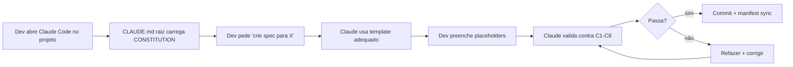
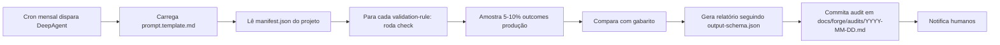
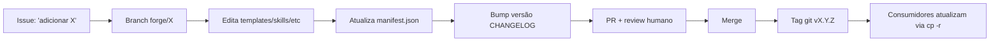

# Architecture — Acme Forge

> Visão estrutural e dos fluxos do framework. Para quem quer entender o "como funciona" antes de instalar.

---

## Conceitos centrais

### 1. Constitution

**O que**: arquivo `.claude/CONSTITUTION.md` com 8 princípios versionados (C1–C8).
**Para quê**: regras fundadoras que toda decisão técnica/comercial respeita.
**Onde**: copiado **inalterado** para todo projeto consumidor; mudanças exigem ADR.
**Audiência**: humanos lêem; Claude Code carrega como contexto inicial; reviewer DeepAgent valida cada princípio mensalmente.

### 2. Manifest

**O que**: `docs/forge/manifest.json` com inventário machine-readable de todos os artefatos.
**Para quê**: contrato com reviewer externo; permite navegação programática.
**Conteúdo**: paths, hashes, versões, descrições, links a princípios, validation rules.
**Audiência**: principalmente máquina (DeepAgent, hooks, scripts CI).

### 3. Templates

**O que**: arquivos `.template.md` em `templates/` — estruturas reutilizáveis.
**Para quê**: garantem que toda spec/ADR/eval/audit segue formato auditável.
**Tipos**: platform-sku, product, diagnostic, eval-case, unit-economics, lifecycle, monthly-audit, clickup-blueprint.
**Audiência**: dev copia pra `src/{categoria}/{nome}/spec.md` e preenche placeholders.

### 4. Reviewer

**O que**: pasta `reviewer/` com prompt, schema, validation rules, exemplos.
**Para quê**: enablement de auditoria externa **independente** (modelo distinto do produção).
**Default**: DeepAgent / GPT-5.5 via OpenAI SDK.
**Audiência**: agente autônomo (Python ou Node) carrega prompt e valida projeto contra Constitution.

### 5. Examples

**O que**: pasta `examples/{domínio}/` com aplicação real do Forge a um caso.
**Para quê**: mostrar como Constitution se traduz em spec real, sem ser prescritivo.
**Atual**: `examples/acme/` com 3 metodologias, portfolio, ClickUp blueprint, products.
**Futuro**: outros projetos podem contribuir seus próprios `examples/{nome}/`.

---

## Fluxo de uso (3 personas)

### A. Dev cria nova capability no projeto consumidor



### B. DeepAgent audita projeto mensalmente



### C. Mantenedor evolui o Forge



---

## Estrutura no projeto consumidor (depois da instalação)

```
seu-projeto/
├── CLAUDE.md                       ← entry point (adaptado do template)
├── .claude/
│   ├── CONSTITUTION.md             ← cópia canônica (não modificar)
│   ├── settings.json               ← cópia canônica (pode adicionar permissões)
│   └── settings.local.json         ← overrides do dev (intocável pelo Forge)
├── docs/
│   ├── forge/                      ← cópia canônica do framework
│   │   ├── manifest.json           ← inventário (atualiza com hooks Forge-4)
│   │   ├── reviewer-contract.md
│   │   └── ...
│   └── adr/                        ← decisões do projeto consumidor
│       ├── 001-...md
│       └── 002-...md
├── templates/                      ← cópia canônica
└── src/                            ← código do projeto consumidor
    ├── skus/{sku}/spec.md          ← criados a partir de templates
    ├── products/{produto}/spec.md
    └── ...
```

**Regra de ouro**: arquivos copiados do Forge (Constitution, templates) ficam **inalterados** no projeto consumidor. Adaptações vivem em arquivos do projeto (CLAUDE.md, ADRs, specs).

---

## Camadas de governança

```
┌─────────────────────────────────────────────────────────────────────┐
│  CAMADA 1 — CONSTITUTION (versionada, imutável sem ADR)             │
│  8 princípios C1-C8 que regem todo o resto                          │
└─────────────────────────────────────────────────────────────────────┘
                              ↓
┌─────────────────────────────────────────────────────────────────────┐
│  CAMADA 2 — TEMPLATES (estruturas que materializam princípios)      │
│  spec, ADR, eval-case, unit-economics, lifecycle, audit             │
└─────────────────────────────────────────────────────────────────────┘
                              ↓
┌─────────────────────────────────────────────────────────────────────┐
│  CAMADA 3 — INSTÂNCIAS (artefatos do projeto consumidor)            │
│  src/skus/triagem-comercial/spec.md                                 │
│  docs/onda-0/unit_economics.md                                      │
│  evals/{sku}/cases/case-001.json                                    │
└─────────────────────────────────────────────────────────────────────┘
                              ↓
┌─────────────────────────────────────────────────────────────────────┐
│  CAMADA 4 — RUNTIME (código que opera os artefatos)                 │
│  src/skus/triagem-comercial/agents/qualifier.ts                     │
│  src/core/pipeline/runner.ts                                        │
└─────────────────────────────────────────────────────────────────────┘
                              ↓
┌─────────────────────────────────────────────────────────────────────┐
│  CAMADA 5 — TELEMETRIA (observação de runtime)                      │
│  Langfuse traces, AiCall persisted, Outcome.costCents               │
└─────────────────────────────────────────────────────────────────────┘
                              ↓
┌─────────────────────────────────────────────────────────────────────┐
│  CAMADA 6 — AUDITORIA (validação independente mensal)               │
│  Reviewer DeepAgent compara C1-C8 com camadas 3, 4, 5               │
│  Output: docs/forge/audits/YYYY-MM-DD.md                            │
└─────────────────────────────────────────────────────────────────────┘
```

Cada camada **respeita** a anterior. Mudança em camada superior força revisão das inferiores.

---

## Three-tier context (princípio C5)

Vocabulário hierárquico aplicável a skills, agentes, prompts, e estruturas externas (ex: ClickUp).

| Tier | Nome alternativo | Conteúdo | Cache strategy |
|---|---|---|---|
| **1 — Estratégico** | L0 (Sincra), Macro | DNA, ICP, ofertas, glossário, princípios | Ephemeral cache forte (helper pattern); raramente muda |
| **2 — Tático** | L1, Meso | Cliente, projeto, baseline, configuração | Cache parcial; muda por cliente/projeto |
| **3 — Operacional** | L2, Micro | Outcome, run, eval case, evento individual | Sem cache; única por execução |

**Herança de leitura**: Tier 1 ⊂ Tier 2 ⊂ Tier 3. Skill Tier 1 NÃO lê Tier 2/3 (princípio C5 hard rule).

**Por que importa**: cache de Tier 1 economiza 70-85% de tokens em prompts de produção quando bem aplicado (helper pattern BMAD).

---

## Modos operacionais (princípio C4)

Todo agente em produção tem modo declarado:

```
┌──────────────────────────────────────────────────────────────────────┐
│                                                                      │
│   SHADOW          ASSISTED              AUTONOMOUS                   │
│   ──────          ────────              ──────────                   │
│                                                                      │
│   Agente roda     Agente propõe         Agente executa               │
│   Output não      Humano aprova         Humano audita amostra        │
│     entregue      antes de              pós-execução                 │
│   Sem billing     executar              Billing ativo                │
│   variável        Sem billing           Métricas: erro/run           │
│   Métricas:       variável              Drift detection ativo        │
│     concordância  Métricas: aprovação                                │
│                                                                      │
│   ↓ promove se    ↓ promove se          ↓ rebaixa se                 │
│     concordância    aprovação >=Y%        SLA breach 2 meses         │
│     >= X%                                                            │
│                                                                      │
└──────────────────────────────────────────────────────────────────────┘
```

Promoção registrada em log auditável. Reviewer audita transições.

---

## Versionamento e compatibilidade

| Componente | Versionado? | Política |
|---|---|---|
| Constitution | SemVer estrito | MAJOR = quebra; mudanças exigem ADR |
| Manifest | SemVer | Acompanha Constitution |
| Templates | Por arquivo (frontmatter) | PATCH/MINOR/MAJOR conforme impacto |
| Reviewer prompt | Por release do Forge | Sempre testar contra exemplo antes de promover |
| Examples | Não-versionado individualmente | Refletem estado em cada release |

Consumidores atualizam por `cp -r` da release nova → diff manual em arquivos adaptados (CLAUDE.md, ADRs específicos).

---

## Decisões fundadoras (referência rápida)

Detalhe completo em [`docs/forge/decisions.md`](./docs/forge/decisions.md).

| ID | Tema | Default |
|---|---|---|
| F1 | Nome | Acme Forge |
| F2 | Distribuição | Repo independente, consumido por projetos terceiros |
| F4 | Reviewer externo | DeepAgent / GPT-5.5 via OpenAI SDK |
| F6 | Helper pattern | Sim, em Tier 1 (cache de DNA/ICP) |
| F7 | Smart routing | Opus (raciocínio crítico), Sonnet (review/QA), Haiku (lint/format) |

---

## Onde olhar para...

| Pergunta | Resposta |
|---|---|
| Quais regras o Forge impõe? | [`.claude/CONSTITUTION.md`](./.claude/CONSTITUTION.md) |
| Como auditar um projeto Forge? | [`reviewer/`](./reviewer/) + [`docs/forge/reviewer-contract.md`](./docs/forge/reviewer-contract.md) |
| Como ficou em outro caso real? | [`examples/acme/`](./examples/acme/) |
| Como estender Forge para meu domínio? | [`CONTRIBUTING.md`](./CONTRIBUTING.md) |
| Vocabulário | [`GLOSSARY.md`](./GLOSSARY.md) |
| Roadmap | [`docs/forge/roadmap.md`](./docs/forge/roadmap.md) |
| O que está fora do escopo | [`docs/forge/out-of-scope.md`](./docs/forge/out-of-scope.md) |

---

## Filosofia em 3 linhas

1. **Princípios são imutáveis sem ADR**. Constitution é a parte estável.
2. **Templates traduzem princípios em estrutura**. Reusáveis em qualquer domínio.
3. **Reviewer externo independente é não-negociável**. Sem auditoria, governance vira fé.
